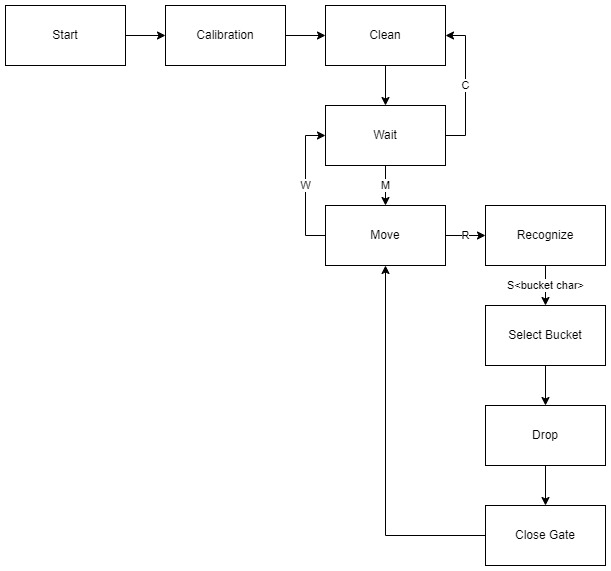

# Lego Sorter project

(c) lego-sorter team (kol+chem), 2022-2025

LegoSorter is an open-source project aiming to build a machine
which would be able to recognize and, eventually, automatically sort
various Lego pieces.

This repo contains a software part of the machine, hardware setup
is performed behind the scenes.

The project uses the following models:

1. Custom model built on top of [VGG-19](https://www.tensorflow.org/api_docs/python/tf/keras/applications/VGG19) or 
[InceptionV3](https://www.tensorflow.org/api_docs/python/tf/keras/applications/InceptionV3) CNNs and trained 
with transfer learning on custom rendered Lego pieces image dataset.

2. Pre-trained [OpenBlock model](https://github.com/blokbot-io/OpenBlok/tree/master)
available from the [project site](https://cdn.blokbot.io/)

So far the project is in some king of R&D stage so no timings are set.
We wil definetelly share the results to the public as soon as
we got the result :)

## Setup

Basic Python setup is required (3.9+), see requirements.txt for list of packages.

Pre-trained custome model checkpoints will be made available later.

Lego images dataset for the training is quite big and I chose not to publish it.

## Model training

To perform custom model training, run `train_custom.py` script. Several image augmentation modes
are supported:

    -g, --gray  Convert images to grayscale
    -e, --edges Convert images to some kind of wireframe by detecting edges
        and eliminating all other data
    -x, --emboss    Combine wireframes with actual images thus highligthing
        the edges (could be combined with --gray)
    -z, --zoom      Apply zoom augmentation while training (this theoretically
        would allow to capture right features at different scales, but
        it would severely slows down the training)

Model weights for the options are saved to different directories under `checkpoints` root.

Other options:

    -n, --epoch Number of epoch to train for (normally its 50-100)
    --noshow    By default the script shows samples and learning results,
        this option turns it off
    --nosave    Turns off model saving (usefull for quick test)

## Model testing

Trained model can be tested with `test.py` script. It supports all augmentation modes
listed above and the following options'

    -m, --model     Model name, one of 'vgg', 'inception' or 'openblock' ('openblock' is default)
    -c, --label     Show random prediction samples for given label (class name)
    -f, --files     Run prediction over given file(-s) (could be specified more than once)
    -x, --confusion Build and show a confusion matrix

Note that 'vgg' and 'inception' models have to be trained before use.

If no options provided, the script would show some random prediction samples
from images dataset.

## Inferrence

The `pipe.py` script is a prototype of the project's control panel. When run,
it will connect to a video camera and allow to classify Lego pieces put under
that camera.

All image augmentation modes are supported as script's options.
When started, several hot keys are available:

    B   Capture a static background (this must be done in order to detect new pieces)
    D   Show debug information (additional windows and log)
    P   Display captured image as it was preprocessed by the model
    C   Start or stop saving video stream to a file (in `out` directory`)
    S   Display video camera settings and adjustments
    Q or ESC    Quit

## Controller state machine

